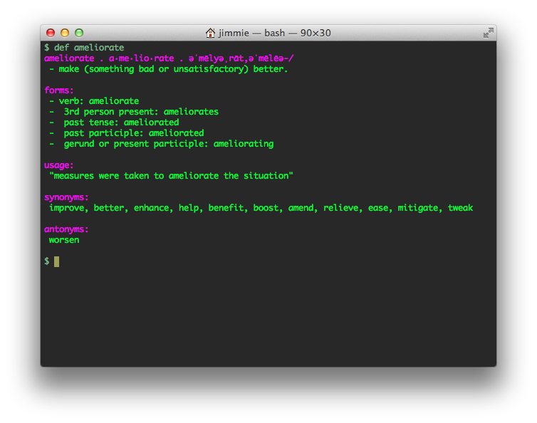

Google "define" from the command line
====================



I love the simplicity of being able to look up words using google's "define {word}" search feature, but sometimes don't want to cutover to a browser to do this. There was at one point an google define API which would have made implementing this a lot easier but it seems to have been de-commed so here we are. This core logic is a python script which leverages Requests to fetch and BeautifulSoup to parse. Terminal color output is supported as well. It is called via a shell script wrapper called "def" which I realize raises some potential conflicts with reserved words so feel free to rename.

## Dependencies
* Python modules
    * `Requests`
    * `BeautifulSoup`

## Usage
```
# clone the repo
cd ~/repos
git clone https://github.com/empireshades/command-line-thesaurus

# optionally add to PATH variable
export PATH=$PATH:$HOME/repos/command-line-thesaurus

# optionally modify the PYBIN variable in the def wrapper script
PYBIN=/usr/bin/python

# run it:

$ def moo
moo . moo . mo͞o/
 - make the characteristic deep vocal sound of a cow.
 - the characteristic deep vocal sound of a cow.

forms:
 - verb: moo
 -  3rd person present: moos
 -  past tense: mooed
 -  past participle: mooed
 -  gerund or present participle: mooing

$
```

## TODO
* Fix synonyms and antonyms
* Better error handling around timeouts
* Create an output function to cut down on redundancy

